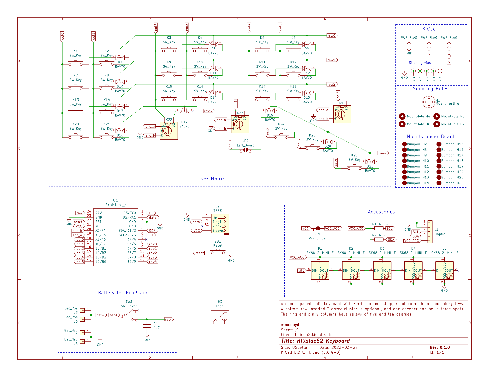
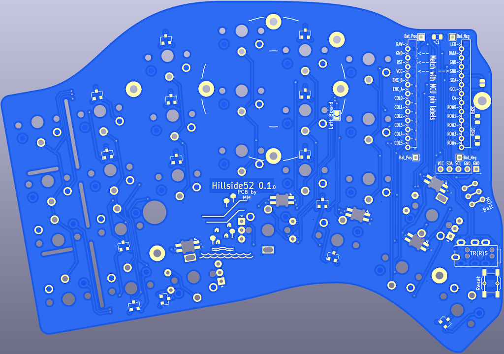

# Hillside 52 Ergonomic Keyboard

Hillside 52 is a split ergonomic keyboard with 3x6+3+5 choc-spaced keys.
It has the aggressive stagger of the Ferris plus
  finger splay, three bottom utility keys or a physical arrow T,
  a longer thumb arc and break-off outer pinkie columns.

The arrow cluster provides a more familiar keymap for users new to small keyboards and utility keys for more seasoned users.
The finger splay more naturally follows our hand's mechanics.
See the Hillside [family readme](../README.md) for features common to all hillside boards. Specific to the Hillside 52 are:

* Bottom utility row or arrow cluster
* Encoder: Three spots for one per side at either: upper or tucked thumb or lowest ring
* Reversible 100 x 143mm PCB
* Optional hotswap with Mill-Max switch sockets

Hillside includes:
 [QMK firmware](https://github.com/qmk/qmk_firmware/tree/master/keyboards/hillside)
 with .json, .c, [via](https://github.com/mmccoyd/hillside/wiki/hill_52/via_config.json) and [vial](https://github.com/mmccoyd/vial-qmk/tree/hillside_52/keyboards/handwired/hillside/52/keymaps) keymaps,
 [ZMK Firmware](https://github.com/mmccoyd/zmk-config),
 a [keyboard layout editor](http://www.keyboard-layout-editor.com/) loadable [diagram](https://github.com/mmccoyd/hillside/wiki/hill_52/keyboard-layout-editor.json) 
 and a [draw.io](https://app.diagrams.net) loadable [diagram](https://github.com/mmccoyd/hillside/wiki/hill_52/drawio_keymap.png).

## Keymap

The default keymap has physical arrow keys, alternate hand modifiers for all keys and a navigation and editing layer. See the [keymap description](https://github.com/mmccoyd/hillside/wiki/Hillside%2052%20Keymap) for details.

## Hardware and Build Guide

See the [wiki](https://github.com/mmccoyd/hillside/wiki)
  for PCB ordering, parts links and a build guide with pictures.

# Why

A visibly easy-to-use keyboard is helpful, especially when new to small keyboards or pulling out a dusty keyboard to type a few lines.
The physical arrow cluster of a 65% keyboard makes it more intuitive than a 60% keyboard, so adding an arrow T to a 40% board seemed a way to make using a 40% board more obvious.

I find a few extra keys lying around lets me have multiple approaches to things. This allows me to gradually choose between approaches over time.
Also, the extra keys don't increase the size much.

## Layout Tester
To test if the key layout suits your fingers,
 print these in landscape mode. 
 
  - Click on each to open the GitHub file view in a new tab. 
  - Click on raw to see just the file in the browser tab.
  - Tell your browser to print the file. But ensure it is at 100% and in landscape mode.
  
SVG files contain dimension information, so your browser should print it the correct size regardless of what size paper you are using.
As an extra check, the images each contain marked length lines, which you can check with a ruler.

The images are black lines on whatever the background is, so they do not like browser dark mode backgrounds but will print black on white.

|  |  |
|---|---|

## Images

